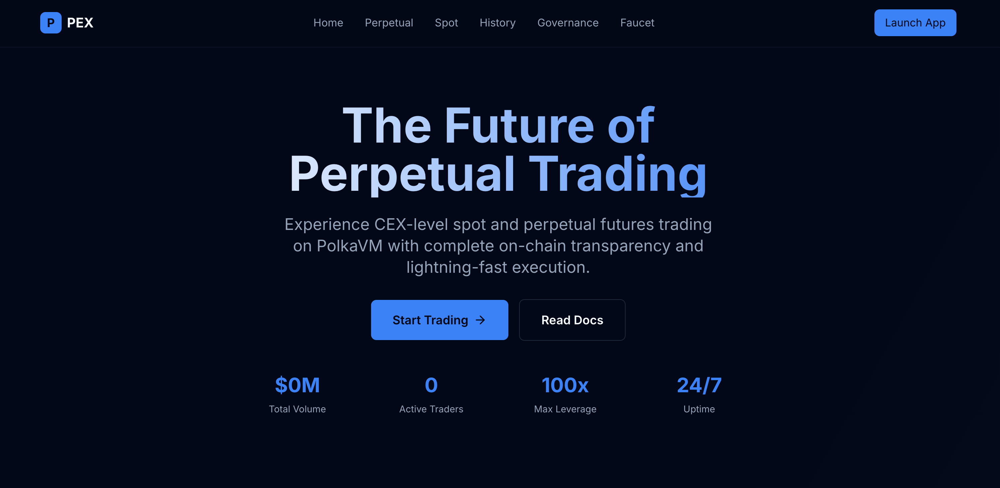

# PolkaVM Perpetual DEX

基于 PolkaVM，完全开源链，DAO自治的链上DEX，采用完全链上撮合的 CLOB 订单簿模型。

<p align="center">
  
</p>

## 项目介绍：为什么需要完全去中心化的交易所（DEX）

过去多年，中心化交易所（CEX）在加密行业占据了绝对主导地位，但其结构性问题屡屡引发系统性风险：
- 黑箱运营、信息不透明：从 FTX 事件到最近的 10.11 币安理财项目引发的市场暴跌与 USDC 脱锚，外界对关键决策、风险暴露和内部流动性的真实情况几乎无从知晓。
- 托管与挪用风险：用户资产被托管在中心化平台，存在再质押（rehypothecation）、错配或挪用的潜在风险。
- 利益冲突与不公平：做市、上币、风控、清算与撮合由同一主体掌控，存在前置交易（front-running）、不公平上币与强制性清算等争议。
- 事故传导效应强：一次黑箱操作就可能触发市场连锁反应，山寨币暴跌甚至接近归零，爆仓资金轻易达到数十亿美元，且“到底发生了什么”无人能确证。

我们推出 PEX（PolkaVM Perpetual Exchange）的目标，是用完全上链、开源可验证、社区治理的方式，提供可与 CEX 比肩的用户体验，同时消除上述结构性风险，让交易回归透明与可审计的秩序。

### 项目核心特性
- Lightning Fast：借助 PolkaVM 的高性能执行环境，实现亚秒级的订单撮合与结算，并将 gas 成本压到极低水平。
- Fully Transparent：所有交易、仓位与清算都发生在链上，无隐藏流程，完全可审计、可验证，真正的信任最小化。
- Professional Tools：专业级交易工具与体验——高级图表、实时订单簿、投资组合分析以及完善的风险管理工具。
- Cross-Chain Ready：构建于波卡（Polkadot）生态，具备天然跨链兼容能力，支持多链资产交易与扩展。
- High Leverage：在健全风险引擎与清算保护下，支持主流加密资产最高 100x 杠杆交易。
- DAO Governed：DEX 完全由 DAO 自治。不收上币费，但也不是“什么币都能上”，而是由社区发起提案并投票决定。开发、运营、商务工作由 DAO 协作推进，关键参数（如费用结构、风控参数、市场设置）由社区治理共识决定。
- Open Source：完整开源、透明可审计，鼓励社区贡献，安全性可被独立验证。
- Fully Decentralized：协议规则由智能合约强制执行，无任何中心化控制路径。
- Built for Builders：以“让真正的建设者发光”为使命。当前市场的“劣币驱逐良币”现象严重，许多代币遵循“发币—炒作—拉盘—出货—归零”的生命周期，空气币横行，真正具备长期价值的产品被淹没。传统交易所并未为有价值项目提供优质的二级市场融资与发现机制。PEX 专注为真正的 web3 builders 提供融资与流动性平台，为价值投资者提供发现并支持高质量项目的场所，让加密市场回归价值，而非无止境的投机。

> 愿景：在不牺牲用户体验的前提下，通过链上撮合与完整透明，重建交易的信任与秩序；通过 DAO 协作与开源共建，让协议持续迭代与进化；通过跨链能力与高性能执行，将去中心化的优势带入更广泛的资产与用户群体。

## 项目架构

```
pex/
├── contracts/                    # 智能合约
│   ├── src/
│   │   ├── core/                # 核心与交易模块
│   │   │   ├── OrderBook.sol
│   │   │   ├── PerpMarket.sol
│   │   │   ├── MarginVault.sol
│   │   │   ├── RiskEngine.sol
│   │   │   ├── SpotMarket.sol
│   │   │   ├── SpotOrderBook.sol
│   │   │   └── FeeCollector.sol
│   │   ├── governance/          # 治理模块
│   │   │   ├── TokenListingGovernor.sol
│   │   │   └── Governance.sol
│   │   ├── oracle/              # 预言机适配
│   │   │   └── OracleAdapter.sol
│   │   ├── interfaces/          # 接口定义（含 ISpot/Perp 等）
│   │   ├── libraries/           # 工具库
│   │   ├── mocks/               # 测试模拟合约
│   │   └── tokens/              # 辅助代币
│   │       ├── PEXToken.sol
│   │       └── SimpleERC20.sol
│   ├── test/                    # 合约测试
│   ├── script/                  # 合约级部署脚本
│   ├── foundry.toml
│   └── package.json
├── scripts/                     # 顶层运维脚本（一键部署、授权、检查等）
│   ├── deploy-assethub-all.js
│   ├── grant-spot-governor.js
│   ├── add-pas-markets-assethub.js
│   └── ...（其余工具与检查脚本）
├── deploy/                      # hardhat-deploy 分步脚本
├── deployments/
│   └── assethub/
│       └── deployment.json      # 部署快照（脚本/前端读取）
├── frontend/                    # Next.js 前端
│   ├── src/
│   │   ├── app/                 # App Router
│   │   ├── components/          # React 组件（trading/spot 等）
│   │   ├── hooks/               # 自定义 Hooks
│   │   ├── lib/                 # 合约地址/ABI/工具
│   │   ├── store/               # Zustand 状态管理
│   │   └── types/               # TypeScript 类型
│   ├── public/
│   ├── package.json
│   └── next.config.js
├── indexer/                     # Subsquid 索引器
│   ├── src/
│   ├── schema.graphql
│   └── package.json
├── images/
│   └── pex.png                  # README 配图
├── docs/                        # 文档
│   ├── Deployment-Guide.md
│   └── contract-architecture.md
├── hardhat.config.js
├── foundry.toml
├── .env
├── package.json
└── README.md
```

## 技术栈

### 智能合约
- Solidity 0.8+
- Foundry + Hardhat
- OpenZeppelin
- PolkaVM 兼容

### 前端
- Next.js 15
- TypeScript
- TailwindCSS
- Zustand
- Wagmi + ethers.js
- TradingView Widget

### 后端基础设施
- Subsquid Indexer
- WebSocket Gateway
- Oracle Price Updater

## 快速开始

请查看 [Deployment-Guide.md](docs/Deployment-Guide.md) 了解详细的部署指南。

## 核心特性

- 🔥 完全链上撮合的 orderbook
- ⚡ 高性能的 PolkaVM 执行环境
- 💰 多资产保证金系统
- 🎯 实时风险管理和清算
- 📊 专业级交易界面
- 🏛️ DAO 治理机制
- 🔍 透明的链上数据

## 开发阶段

- [x] Phase 1: MVP