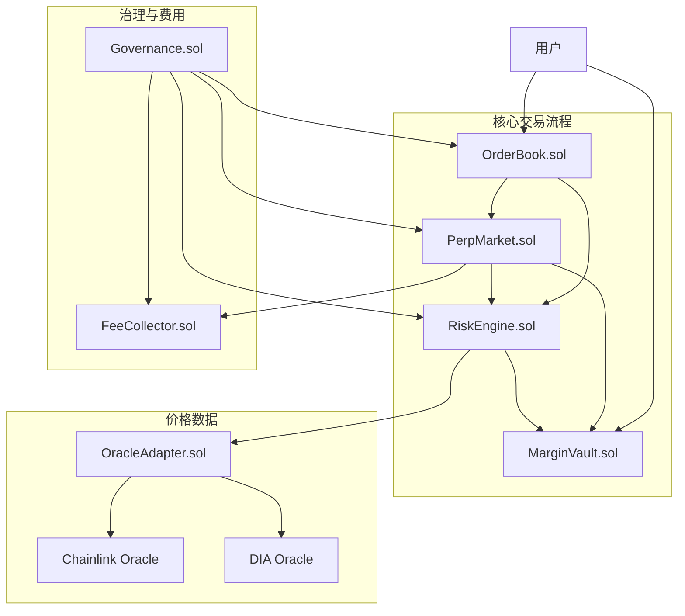
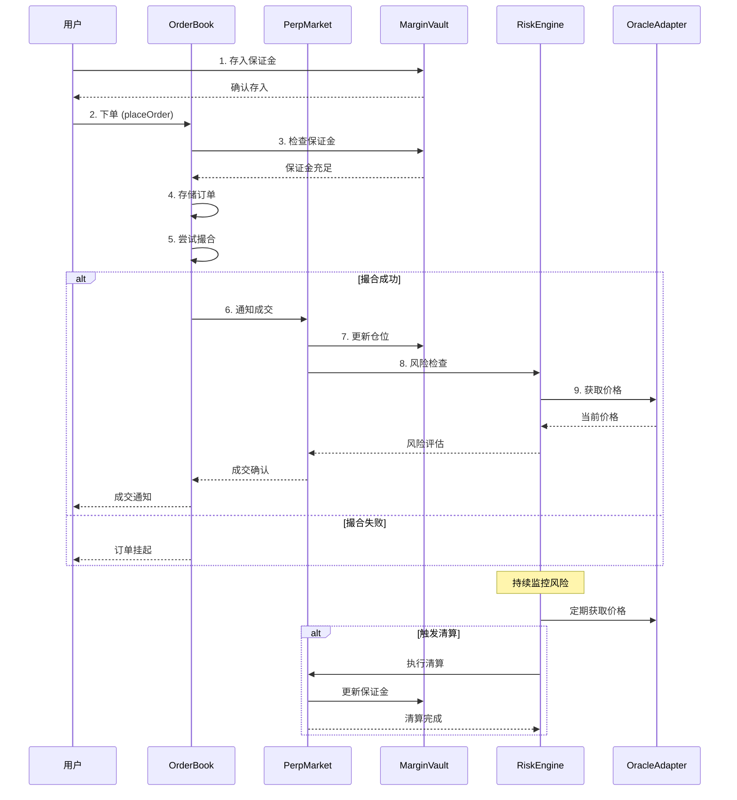
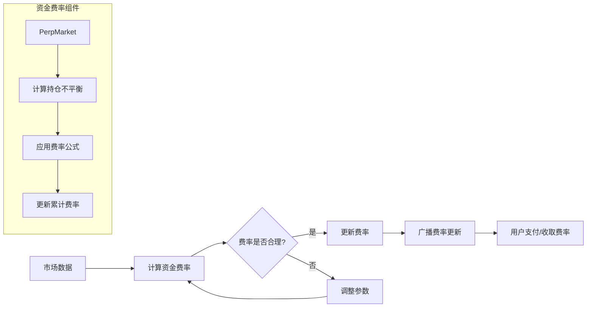
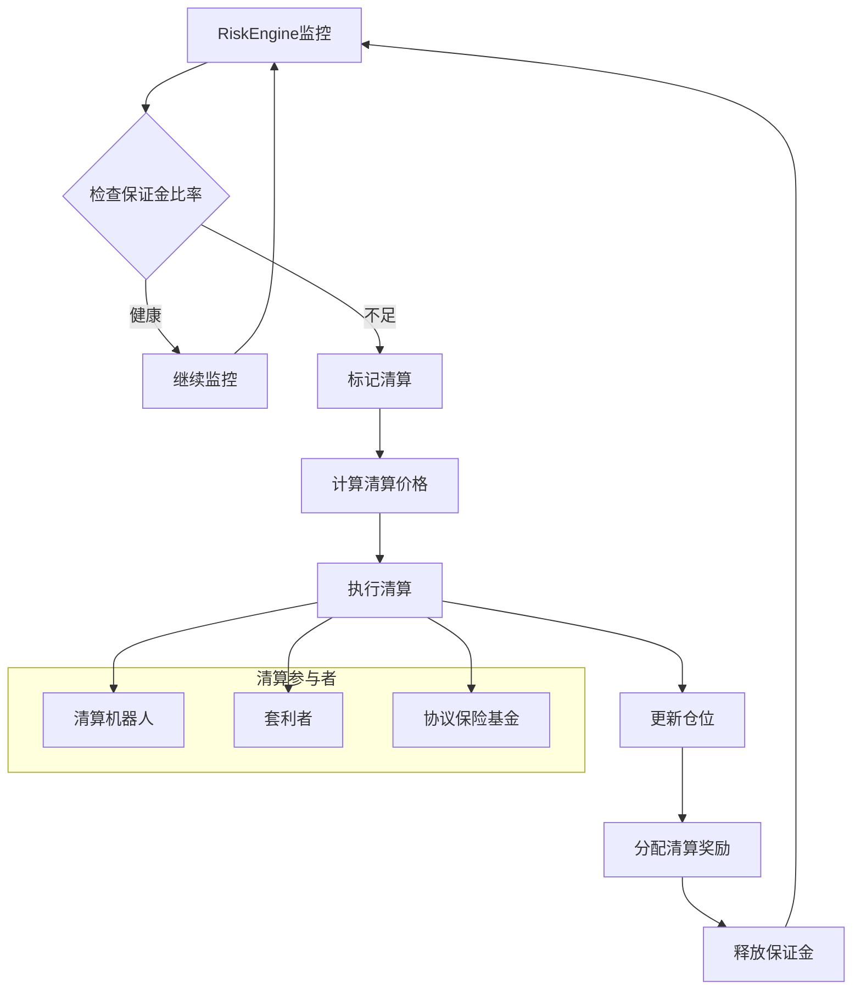
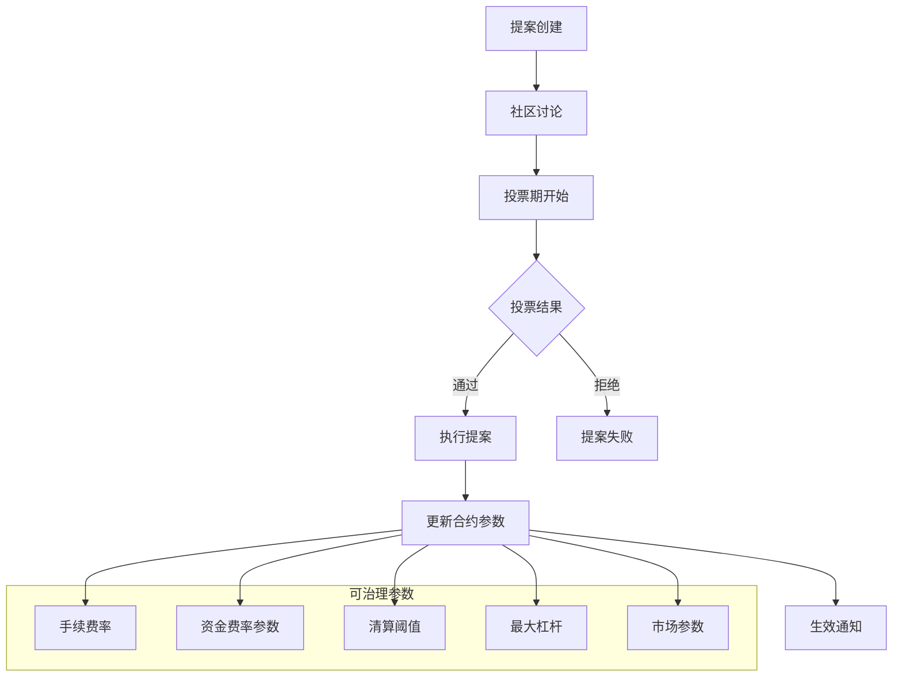
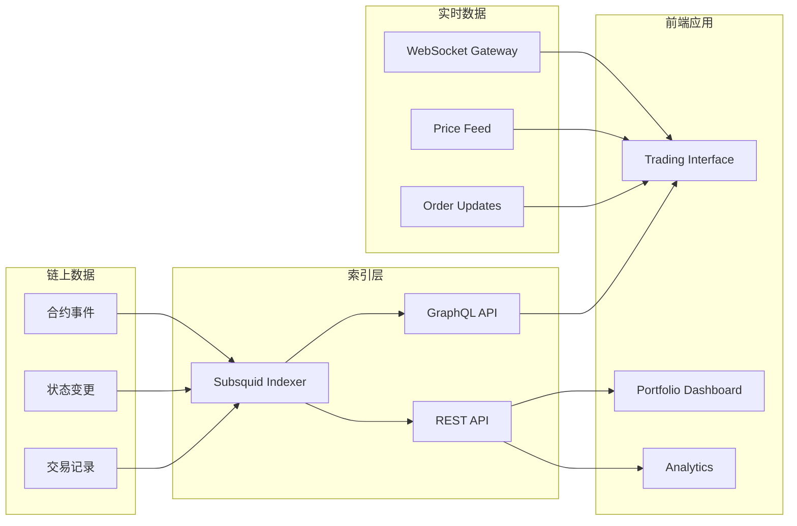
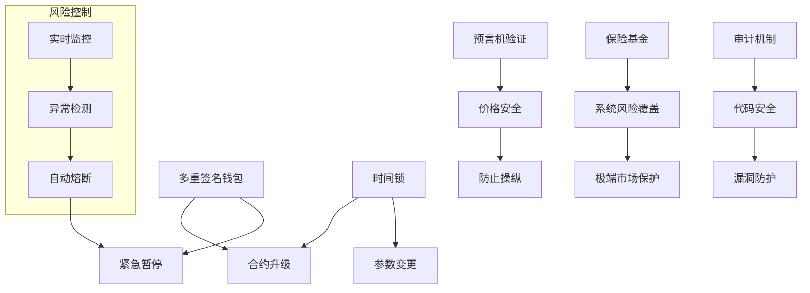

# 合约架构设计

## 系统概览

PolkaVM Perpetual DEX 采用模块化的智能合约架构，实现完全链上的永续合约交易。

## 合约间交互流程

## 交易流程详细图

## 资金费率计算流程

## 清算机制流程

## 治理流程

## 数据流架构

## 安全机制

## 性能优化策略

1. **Gas 优化**
   - 批量操作减少交易次数
   - 状态变量打包存储
   - 事件日志优化

2. **撮合效率**
   - 价格级别索引
   - 订单优先级队列
   - 批量撮合机制

3. **状态管理**
   - 增量更新策略
   - 缓存机制
   - 延迟计算

4. **扩展性设计**
   - 模块化架构
   - 可升级代理模式
   - 跨链兼容性预留